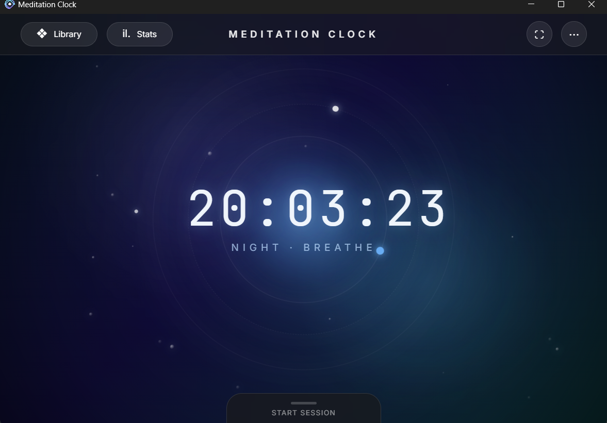

##  DEPRECATED: As of 6/18/2026 [Iran has promised that they WON'T cut the international internet anymore in the upcoming instances of crises in the country](https://www.asianewsiran.com/fa/newsagency/39098/internet-no-shutdown-crisis) 

### Although I highly doubt that, if it's true, there won't be any need for this electron app or repo anymore. Hence I updated the json and got a fully updated signed build from the project today. Before deprecating the repo. However, I know no one uses this build other than me. :P 

# Meditation Clock (Electron)

A desktop port of the [Meditation Clock web app](https://github.com/ihummingbird/meditationclock) built with Electron.  
I created this so I could keep using my meditation timer during the **international internet blackout in Iran** when the website was unreachable.

<p align="center">
  
</p>

##  Features

-  **Works completely offline** – no internet connection required after installation. That's the whole point of it.
-  It has all of the themes and features of the main repo till the last update
-  Track your sessions and progress (If you have internet, same logic as the web version).

##  Why this exists

I do meditation daily. When I temporarily lost internet access, I needed a way to keep meditating without disruption. I made an exclusive android app for my phone but on my laptop, honestly I really didn't like copying the html address everytime. And viola, another bloaty Electron app is born. :)  This Electron app is a one‑to‑one desktop copy of the website, and it will always work offline.

> My main effort goes into the **main repository** and the **live website**. This Electron port will only receive occasional updates, if any. Consider it a stable, offline‑friendly snapshot.

##  Download

Grab the latest Windows installer from the [Releases page](https://github.com/ihummingbird/meditationclock-electron/releases).  

## OR Build it youself from source (offline)

If you want to rebuild the app yourself (e.g., after making changes):
> Note that due to international internet blackout, I had to build the project with an old Elctron binary that I could randomely find on YasDL (Thank god I found one). I also had to disable the app signing cause I couldn't download the packages and no local mirror had it. Don't worry about the exe, it's safe. Or don't :), and build it yourself. :D

1. **Clone the repo**  
   ```bash
   git clone https://github.com/ihummingbird/meditationclock-electron
   cd meditationclock-electron
   ```

2. **Install dependencies** (you’ll need Node.js and npm)  
   ```bash
   npm install
   ```

3. **Build the Windows installer** (offline friendly)  
   ```bash
   npm run build
   ```
   
   The output `.exe` will be inside the `dist/` folder.

   Ignore the ```build:offline``` part, I had to use it in my case. Getting any kind of a build with an outdated electron binary without any service mirrors working. 


##  License

You know, use as you please but please don't monitize it, or recieve money for it. It's because of the themes mostly.

But here goes the boring talk.

All assets in this repository – **code, themes, icons, and documentation** – are licensed under the  
[Creative Commons Attribution‑NonCommercial‑ShareAlike 4.0 International License](LICENSE).

This means you are free to:
- **Share** – copy and redistribute the material in any medium or format
- **Adapt** – remix, transform, and build upon the material

Under the following terms:
- **Attribution** – You must give appropriate credit, provide a link to the license, and indicate if changes were made.
- **NonCommercial** – You may not use the material for commercial purposes.
- **ShareAlike** – If you remix, transform, or build upon the material, you must distribute your contributions under the same license as the original.

The themes included in this app are especially protected by these terms – they cannot be extracted and used commercially.  
See the [full license text](LICENSE) for details.

---

Made with ❤️ by Hummingbird  

